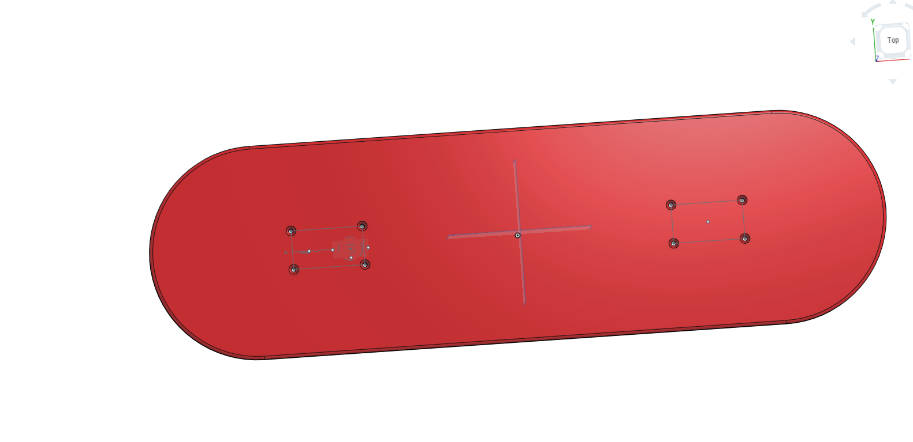
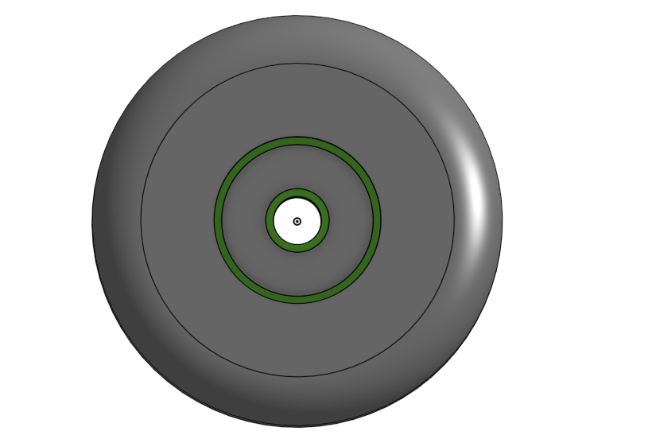
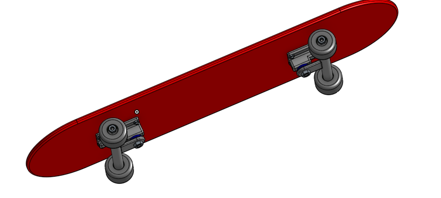
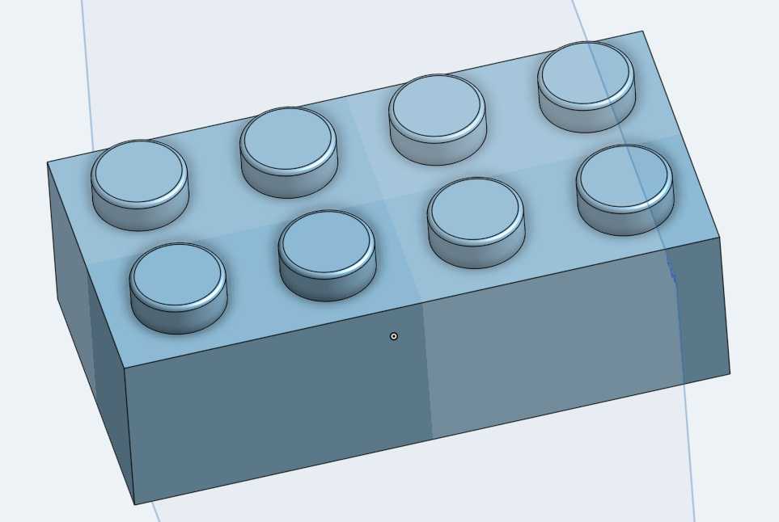
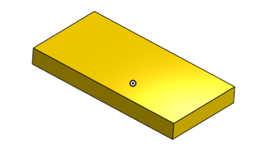

# Intermediate_CAD

## 2.1 Designing the Deck

### Description:
Designing the deck was pretty easy to do because there was steps to help me complete the deck. It was it a pretty quick assignment that didnt take me long to complete.

### Evidence:
[Link to my skateboard in Onshape](https://cvilleschools.onshape.com/documents/4f241e15e2749a552c15adc5/w/1a304f0a79cda24600361051/e/a7ad9ced9648c0cc6c678662)

### Image:

## Reflection:
Buliding the deck made me learn how to use fillets properly. It also made me learn how to use the mirror tool and when to use it properly thanks to Mr. H. Thoose two things were the only things that I learned to use or got help on.

---

## 2.2 Designing the Trucks

## Description: 
There was a lot of sketches being made to this one part. It took some time to do but I did complete it. It was prolly the most challenging assignment I have done in a while.

### Evidence:
[Link to my skateboard in Onshape](https://cvilleschools.onshape.com/documents/4f241e15e2749a552c15adc5/w/1a304f0a79cda24600361051/e/a7ad9ced9648c0cc6c678662)

## Image: 

## Reflection: 
While making the trucks I learned how to make things symmetric duriing an extrude. I also learned that you need to have a dimension for pretty much everything in this part. I learned a little bit more geometry by making this part. This is also my first time sketching on the top plane ever.

---
## 2.3 Wheel and Bearings

## Description: 
It was a quck easy assignment that didn't take that long to do. The stepswere pretty easy and simple.

### Evidence:
[Link to my skateboard in Onshape](https://cvilleschools.onshape.com/documents/4f241e15e2749a552c15adc5/w/1a304f0a79cda24600361051/e/a7ad9ced9648c0cc6c678662)

## Image:
 
     
     
     
## Reflection: 
I learned how to add multiple fillets into one part. I also learned how to use the revovle tool in this part aswell. Making the wheel and bearing is very easy if you just follow the steps that it ask you to do.     

---

 ## 2.4 Putting it all together
 
 
 
## Description:
It was an assignment that took some time to do. I was confused on trying to revovle mate fro the wheels and bearings but by the help of Mr.H I succesfully completed the assignment.

## Evidence:
[Link to my skateboard in Onshape](https://cvilleschools.onshape.com/documents/4f241e15e2749a552c15adc5/w/1a304f0a79cda24600361051/e/a7ad9ced9648c0cc6c678662)

## Images:
 
 
 
 ## Reflection:
 It was a challenging assignment that took a good amount of time to do. I learned how to replicate a piece of the sketch and that well help me the assignments in the future. It makes everything much quicker instead of it taking 1 hour just to put the same part in 12 times.

---

 ## 3.1 How the Pros Do It
 
 
  
 ## Description:
 It was a pretty easy assignment that didn't take long and it was pretty fun making a lego. I never made a lego in onshape before until now. 
 
 
 ## Evidence:
 [Link to my lego in Onshape](https://cvilleschools.onshape.com/documents/15729b3465d9a7d04e305d12/w/37062c8eba2507fb52874f84/e/ac4b3f8c702c76487ca63979)
 
 
 
 ## Images:
 
 
 
 
 ## Reflection:
 Once again replicating is a very important and helpful tool to use in onshape too make things very easier. Also make sure everything is defined and has no blue all black before you are done sketching.

---

 ## 3.2 One Brick to Rule Them All
 
 
 ## Description:
 It was an assignment were we had to add a lot of configuration to make it colorful, diffrent shape, and size. It was pretty easy and didn't take that long to do.
 
 
 ## Evidence:
 [Link to my lego in Onshape](https://cvilleschools.onshape.com/documents/15729b3465d9a7d04e305d12/w/37062c8eba2507fb52874f84/e/ac4b3f8c702c76487ca63979)
 
 
 ## Images:
 

## Reflection:
I learned how to use the configuration panel and how to make things different sizez, shape, and color. I think its going to help me on my project because it makes seperate parts and you can make them different from each other.
